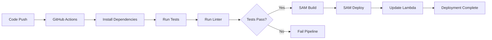

# Deployment Guide

## Overview

This project uses AWS SAM (Serverless Application Model) for infrastructure as code and GitHub Actions for CI/CD automation.

## Deployment Environments

### Development
- **Branch**: `develop`
- **Stack Name**: `alexa-lunch-dad-dev`
- **Trigger**: Push to develop branch
- **Purpose**: Testing and development

### Production
- **Branch**: `main`
- **Stack Name**: `alexa-lunch-dad-prod`
- **Trigger**: Push to main branch
- **Purpose**: Live skill for users

## Manual Deployment

### Prerequisites

```bash
# Install AWS SAM CLI
brew install aws-sam-cli  # macOS
# or follow: https://docs.aws.amazon.com/serverless-application-model/latest/developerguide/install-sam-cli.html

# Configure AWS credentials
aws configure
```

### Deploy to Development

```bash
# Option 1: Using npm script
npm run deploy:dev

# Option 2: Using deployment script
chmod +x scripts/deploy-dev.sh
./scripts/deploy-dev.sh

# Option 3: Manual SAM commands
sam build
sam deploy --config-env dev
```

### Deploy to Production

```bash
# Option 1: Using npm script
npm run deploy:prod

# Option 2: Using deployment script
chmod +x scripts/deploy-prod.sh
./scripts/deploy-prod.sh

# Option 3: Manual SAM commands
sam build
sam deploy --config-env prod
```

## Automated Deployment (GitHub Actions)

### Setup GitHub Secrets

Required secrets in GitHub repository settings:

```
AWS_ACCESS_KEY_ID          # AWS IAM user access key
AWS_SECRET_ACCESS_KEY      # AWS IAM user secret key
ALEXA_SKILL_ID_DEV        # Development Alexa skill ID
ALEXA_SKILL_ID_PROD       # Production Alexa skill ID (optional)
```

### Workflow Triggers

1. **Push to `develop`**:
   - Runs all tests
   - Deploys to development environment
   - Updates dev Lambda function

2. **Push to `main`**:
   - Runs all tests
   - Deploys to production environment
   - Updates production Lambda function

3. **Pull Request**:
   - Runs tests only
   - No deployment
   - Validates code quality

### Deployment Process



## SAM Configuration

### samconfig.toml (Generated)

```toml
version = 0.1

[dev]
[dev.deploy.parameters]
stack_name = "alexa-lunch-dad-dev"
region = "us-east-1"
capabilities = "CAPABILITY_IAM"
parameter_overrides = "SkillId=YOUR_DEV_SKILL_ID"

[prod]
[prod.deploy.parameters]
stack_name = "alexa-lunch-dad-prod"
region = "us-east-1"
capabilities = "CAPABILITY_IAM"
parameter_overrides = "SkillId=YOUR_PROD_SKILL_ID"
```

## Rollback Strategy

### Automated Rollback

AWS Lambda maintains previous versions. To rollback:

```bash
# List function versions
aws lambda list-versions-by-function \
  --function-name AlexaLunchDad \
  --region us-east-1

# Update alias to previous version
aws lambda update-alias \
  --function-name AlexaLunchDad \
  --name LIVE \
  --function-version $PREVIOUS_VERSION \
  --region us-east-1
```

### CloudFormation Rollback

```bash
# Rollback entire stack
aws cloudformation rollback-stack \
  --stack-name alexa-lunch-dad-prod \
  --region us-east-1
```

## Monitoring Deployments

### View Deployment Logs

```bash
# GitHub Actions logs
# Go to: https://github.com/YOUR_REPO/actions

# CloudFormation events
aws cloudformation describe-stack-events \
  --stack-name alexa-lunch-dad-prod \
  --region us-east-1

# Lambda logs
sam logs -n AlexaLunchDadFunction \
  --stack-name alexa-lunch-dad-prod \
  --tail
```

### Health Check

```bash
# Get Lambda function info
aws lambda get-function \
  --function-name AlexaLunchDad \
  --region us-east-1

# Test Lambda directly
aws lambda invoke \
  --function-name AlexaLunchDad \
  --payload file://tests/integration/sample-request.json \
  --region us-east-1 \
  response.json
```

## Troubleshooting

### Deployment Fails

1. **Check AWS credentials**:
   ```bash
   aws sts get-caller-identity
   ```

2. **Verify SAM template**:
   ```bash
   sam validate
   ```

3. **Check CloudFormation stack status**:
   ```bash
   aws cloudformation describe-stacks \
     --stack-name alexa-lunch-dad-dev
   ```

### Lambda Not Updating

1. **Clear SAM cache**:
   ```bash
   rm -rf .aws-sam
   sam build --use-container
   ```

2. **Force update**:
   ```bash
   sam deploy --no-confirm-changeset --force-upload
   ```

### GitHub Actions Failing

1. Check action logs in GitHub UI
2. Verify secrets are set correctly
3. Ensure AWS credentials have sufficient permissions

## IAM Permissions Required

Minimum IAM policy for deployment:

```json
{
  "Version": "2012-10-17",
  "Statement": [
    {
      "Effect": "Allow",
      "Action": [
        "cloudformation:*",
        "lambda:*",
        "iam:CreateRole",
        "iam:AttachRolePolicy",
        "iam:PassRole",
        "s3:*",
        "logs:*"
      ],
      "Resource": "*"
    }
  ]
}
```

## Post-Deployment Steps

1. **Verify Lambda deployment**:
   - Check AWS Lambda console
   - Verify function code updated
   - Check environment variables

2. **Test Alexa skill**:
   - Open Alexa Developer Console
   - Test in simulator
   - Verify responses

3. **Monitor logs**:
   - Check CloudWatch Logs
   - Verify no errors
   - Monitor invocation metrics

## Best Practices

1. **Always test before deploying to prod**
2. **Use feature branches for new features**
3. **Keep develop and main in sync**
4. **Tag production releases**
5. **Monitor deployments in CloudWatch**
6. **Keep secrets secure and rotated**
7. **Document all manual interventions**

## Related Documentation

- [Setup Guide](SETUP.md)
- [Architecture Overview](ARCHITECTURE.md)
- [Testing Guide](TESTING.md)
